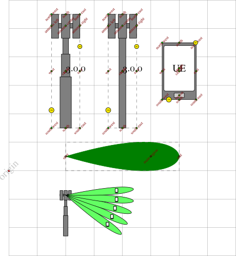

tikz-mimo-shapes
================

Node shapes regarding transmitter/receivers with multiple antennas, as well
as a simple "base station" and "mobile station" shapes.

The main advantage of using these shapes, compared to drawing directly in
Tikz, is that we define a few useful anchors, such as the usual "north",
"northeast", "northeast", "east", "west", etc..

# Instructions

All you need to do to use these shapes it to include the `mimoshapes.tex`
or the `basestation.tex` file in your document. That is, put
`\input{mimoshapes}` or `\input{basestation}` in your document before your
draw. See the `testbasestation.tex` and `testmimoshapes.tex` files for
usage examples.

# Shape options

Some usual shape options can be used, such as `minimum width`, `minimum
height`, `fill`, `inner sep` and `outer sep`. Besides these options some of
the shapes accept some new options. Particularly the shapes defined in
`mimoshapes.tex`. These options are `right antennas` or `left antennas`;
`antenna offset`, `antenna base height`, `antenna side`, etc. See the
`testmimoshapes.tex` file for examples.

# Old PGF versions

At some point PGF changed the macro "\shape@name" to
"\pgf@sm@shape@name". This macro was used in the mimoshapes.tex file, which
was updated to use "\pgf@sm@shape@name". If you have an older version of
PGF and can't compile the examples here, checkout the version pointed by
the "OldPGF" tag and try compiling the examples with it.

# Screenshots

Below you can find the expected results after compiling the
`testmimoshapes.tex` and `testbasestation.tex` files.

 
